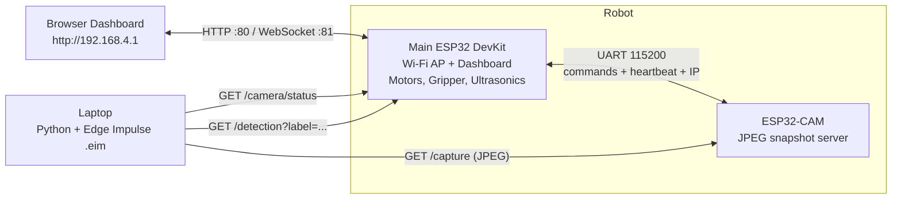
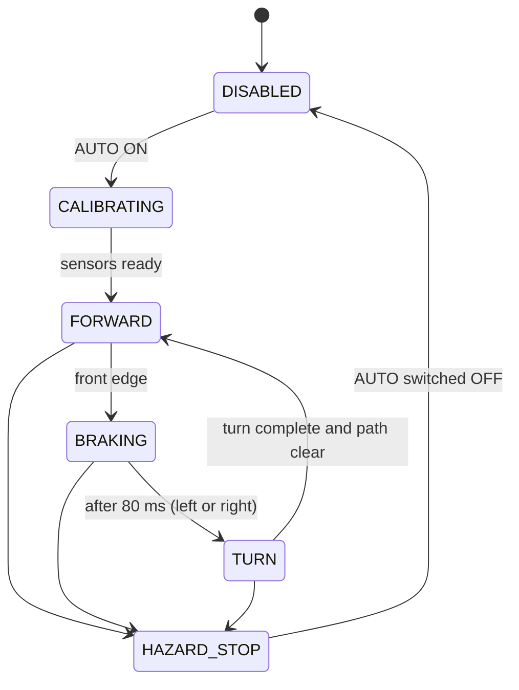

<div align="center">

# 🤖 Robolympics Project — Turbo Car

### Wi-Fi-controlled 4WD robot with gripper, shooter, front wedge, autonomous edge-safe navigation, and AI shape recognition


**Team:** `TURBO` &nbsp;|&nbsp; **Institution:** Faculty of Engineering, Ain Shams University &nbsp;|&nbsp; **Event:** Robolympics 2026 — Escape Protocol Edition (Aviation Club, ASU)

### 🥈 Runner-Up — 2nd Place · "Wedge of Glory"

</div>

---

## 📑 Table of Contents

1. [Overview](#-overview)
2. [Competition Context](#-competition-context)
3. [Key Features](#-key-features)
4. [System Architecture](#-system-architecture)
5. [Repository Structure](#-repository-structure)
6. [Mechanical Design](#-mechanical-design)
7. [Hardware & Electronics](#-hardware--electronics)
8. [Software Requirements](#-software-requirements)
9. [Getting Started](#-getting-started)
10. [Operating the Robot](#-operating-the-robot)
11. [Firmware Details](#-firmware-details)
12. [Autonomous Navigation](#-autonomous-navigation)
13. [Vision Pipeline](#-vision-pipeline)
14. [Communication Protocols](#-communication-protocols)
15. [How the Design Supports Scoring](#-how-the-design-supports-scoring)
16. [Lessons Learned](#-lessons-learned)
17. [Replication Guide](#-replication-guide)
18. [Troubleshooting](#-troubleshooting)
19. [Documentation](#-documentation)
20. [Team](#-team)
21. [Acknowledgements](#-acknowledgements)

---

## 🎯 Overview

**Turbo Car** is our entry for **Robolympics 2026 — Escape Protocol Edition**, where it finished **second overall**. It is a four-wheel-drive robot that can be driven in real time from a browser, pick up objects with a servo gripper, fire a soft projectile with a 3D-printed shooter, push and pin opponents with a front wedge, and **recognise three object shapes — Pyramid, Cube, and Ball — using a machine-learning model trained with Edge Impulse**. It also includes an edge-avoidance autonomous mode for the raised Track I course.

The system is split across three cooperating nodes:

| Node | Role |
|------|------|
| **Main ESP32 (DevKit)** | Creates the Wi-Fi access point, hosts the web dashboard, drives the motors and gripper, runs autonomous navigation, and bridges to the camera. |
| **ESP32-CAM (AI Thinker)** | Acts as a lightweight snapshot server. Serves a JPEG frame on demand and reports its state to the Main ESP32. |
| **Laptop (Python)** | Pulls frames from the camera, runs Edge Impulse inference, and posts the result back to the robot's dashboard. |

Heavy inference runs on the laptop so the microcontrollers stay responsive, keeping control latency low and behaviour reliable.

---

## 🏁 Competition Context

Robolympics 2026 — Escape Protocol Edition was organised by the **Aviation Club of Ain Shams University**. Teams of five to six undergraduates design **one robot that must compete in two tracks**. The theme is a heist getaway: escape a booby-trapped facility (Track I), then fight a rival vehicle for a final prize (Track II).

### Track I — The Vault Escape (100 points)

A single timed run of up to **10 minutes** through four zones, completed in sequence:

| Zone | Challenge |
|------|-----------|
| 1 | Torque Ramp |
| 2 | Suspension Stairs |
| 3 | Rubble Area (including loose stones) |
| 4 | Authentication Override — identify a token (Cube, Pyramid or Sphere) with the onboard camera, show the result on the dashboard, **stop completely**, then shoot a soft projectile into the matching hole on a wall 50–100 cm away (holes 80–110 cm above ground) |

- Three shooting attempts: **15 / 10 / 5 points**.
- Bonuses: **+2** per 30 s remaining, **+10** per zone completed purely by sensors (autonomous).
- Penalties: **−3** for each topple or hand touch.

### Track II — The Extraction Clash (knockout)

One-versus-one rounds of up to three minutes on a square platform, **fully manual control**. A round is won by delivering the central flag (60 cm high, 3 cm diameter) into the opponent's zone, by a knockout (opponent flipped or immobile for 10 s), or by pushing the opponent off the platform three times. Weapons, projectile launchers and liquid dispensers are prohibited; flipping and pinning mechanisms are allowed. Bracket placement adds a bonus: +60 champion, **+40 runner-up**, +30 third, +20 fourth, +10 quarter-final exit.

### Mandatory robot limits

| Parameter | Rule-book limit |
|-----------|-----------------|
| Base footprint (incl. wheels) | 30 cm × 30 cm max |
| Height | 50 cm max |
| Mass | 5 kg max |
| Frame materials | Wood, acrylic or 3D-printed plastic — no metal frames |
| Power | DC only, 24 V max |
| Control | Wireless only, fully remote-controlled, live sensor data shown on the control unit |
| Shooter | Fixed (may be detachable); 3–5 cm ping-pong or rubber balls |
| Gripper / arm | Modular, easy to install and remove between tracks |
| Emergency stop | Externally accessible physical master kill switch or red pull-jumper that cuts all power |
| Camera | Required for the Zone 4 AI task |

---

## ✨ Key Features

- **Real-time control** over WebSocket (port `81`) with a 450 ms control-timeout failsafe.
- **4-motor PWM drive** with proportional differential steering (inside wheels slow down instead of reversing) and tank-style spot turns.
- **Servo gripper** (MG995) driven via the ESP32's built-in LEDC peripheral — used for the Track II flag.
- **3D-printed shooting mechanism** for the Zone 4 precision shot.
- **Front wedge attachment** (17.1° incline) for Track II contact play.
- **Autonomous edge-safe navigation** using four ultrasonic sensors, ground-distance calibration, median-of-5 filtering, hysteresis, and a stale-sensor safety stop.
- **AI shape detection** (Pyramid / Cube / Ball) with Edge Impulse — supports both grayscale and RGB models.
- **Self-healing camera link**: IP discovery over UART, heartbeat monitoring, and automatic state recovery after a camera or Wi-Fi reconnect.
- **Low-latency Wi-Fi tuning**: power-save disabled and TX power maximised on both nodes.
- **Self-hosted live dashboard** (single HTML page served from the ESP32 — no internet or app install needed) showing robot status, round-trip time, camera state, detection results and gripper state.

> ⚠️ **Note on autonomous mode:** the autonomous navigation code is complete in this repository, but a power-related failure just before the event cost the team its autonomous capability during competition. See [Lessons Learned](#-lessons-learned).

---

## 🏗 System Architecture



### Subsystems

| Subsystem | Hardware | Responsibility |
|-----------|----------|----------------|
| Main controller | ESP32 development board | Wi-Fi AP, dashboard server, WebSocket control, motor PWM, servo, sensors, status broadcast, failsafes |
| Camera node | AI-Thinker ESP32-CAM | Joins the robot network, serves one JPEG per request, reports state and IP over UART |
| Vision host | Laptop (Linux / WSL), Python, OpenCV | Fetches images, runs the Edge Impulse model, sends the result back |
| Drive | 4 DC gear motors, H-bridge drivers | Locomotion |
| Manipulation | Servo gripper | Pick up and carry objects such as the Track II flag |
| Perception | 4 × ultrasonic sensors | Ground-edge detection for autonomous mode |
| Targeting | 3D-printed shooter | Launch a soft projectile in Zone 4 |
| Attachment | Front wedge | Contact play in Track II |

### Data flow for shape detection

1. The laptop asks the Main ESP32 for the camera's current IP (`/camera/status`).
2. It requests a single JPEG from the camera (`/capture`).
3. The frame is classified by the Edge Impulse model (`.eim`).
4. The label, confidence, and per-class scores are sent back to the Main ESP32 (`/detection`).
5. The Main ESP32 stores the result and broadcasts it to the dashboard on the next 50 ms status push.

---

## 📁 Repository Structure

| File | Description |
|------|-------------|
| `esp32_devkit_4motorcontrol_wifi.ino` | Main ESP32 firmware: Wi-Fi AP, dashboard, WebSocket control, motor/gripper drive, UART camera link, autonomous navigation. |
| `esp32cam_edge_impulse_shape_only.ino` | ESP32-CAM firmware: Wi-Fi station, `/capture` and `/status` HTTP endpoints, UART state reporting, flash LED control. |
| `laptop_edge_impulse_robot.py` | Laptop script: frame capture → Edge Impulse inference → result upload to the robot. |
| `model_rgb.eim` | Edge Impulse Linux model (RGB input, ~11.3 MB). |
| `model_gray.eim` | Edge Impulse Linux model (grayscale input, ~11.3 MB). |
| `Turbo_Car Functions_Explained_EN.pptx` | Presentation explaining the robot's functions. |
| `CMakeLists.txt` | CMake project configuration. |
| `docs/` | Project documentation report and images (see [Documentation](#-documentation)). |

---

## 🛠 Mechanical Design

### Design flow

1. Define sizes and fits for motors and servos.
2. Model parts and the chassis assembly in **SolidWorks** (some gripper parts in Autodesk Inventor).
3. Export **STEP** (sharing) and **STL** (printing) files; **DXF** for flat sheet parts.
4. Slice in **Cura 4.8** with **0.25 mm** layers.
5. Print, assemble and test.

### Chassis

Based on a **Wild Thumper 4WD** chassis assembly with custom parts. Two generations exist:

- **Chassis 1.0 (archived):** flat patterns for sheet-cut plates (top chassis, small chassis 1, frame connector) as DXF.
- **Chassis 1.1 (final):** complete STEP set — top chassis 4WD, small chassis 1 and 2, frame connector, motor case and cover, side module, and a side panel with button.

| Part | Size | Notes |
|------|------|-------|
| Main plate | 283.54 × 100 mm | R10 corners, mounting-hole grid |
| Side panel | 134 × 66 mm | Hole grid |
| Rounded bracket | 30 × 50 × 5 mm | R5 corners |

The mounting-hole grids let sensors and boards be repositioned during tuning. The chassis uses 3D-printed parts and acrylic sheets (no metal frame, per the rules).

### Drive module

Each wheel has its own DC motor held in a printed motor case closed by a cover. Four motor sets were sliced onto one plate.

| Component | Specification |
|-----------|---------------|
| Motors | DC gear motor **JGA25-370-12V-130RPM**, 20 kg·cm |
| Wheels | 85 mm diameter |
| Battery | 12 V |
| Motor driver | ZK-5AD H-bridge module(s) |

| Printed part | Size (mm) | Qty |
|--------------|-----------|-----|
| Motor case | 34 × 67 × 63 | 4 |
| Case cover | 30 × 30 × 16 | 4 |
| Motor set (combined) | 34 × 67 × 64 | 4 |

**Print job (4 motor sets):** Cura 4.8.0 · 18 h 47 min · 76.04 m filament · 0.25 mm layers · 200 °C nozzle / 60 °C bed · ~159 × 171 × 34 mm footprint.

### Gripper

A servo-driven two-claw mechanism with a gear train and bearing guides, adapted from a robotic-hand gripper design into separate left/right claws, a gear, a servo mount and fixation mounts. The servo (**MG995**) moves from open (5°) to closed (180°).

| Part | Size (mm) | Function |
|------|-----------|----------|
| Left claw | 101 × 116 × 13 | Gripping jaw |
| Right claw | 75 × 89 × 13 | Gripping jaw |
| Gear | 28 × 28 × 15 | Couples the claws |
| Servo mount | 83 × 39 × 37 | Holds servo |
| Mount B | 35 × 69 × 13 | Bracket |
| Bearing fix (×2) | 21 × 21 × 5 | Holds bearings |
| C fixation | 50 × 21 × 30 | Holds bracket |

### Shooting mechanism

A separate printed assembly (base, shooter part, slot and bush) for the Zone 4 shot. Per the rules it is fixed to the robot (may be detachable) and fires only 3–5 cm balls **from a complete stop**. The initial design used a fixed angle with excessive force — see [Lessons Learned](#-lessons-learned).

> The shooter's firing actuation is not part of the firmware in this repository.

### Wedge attachment

A low front wedge with a **17.1° incline** and principal dimensions of 300 / 150 / 80 mm (full and half-wedge STEP files plus a dimensioned drawing). It is the Track II contact attachment for getting under, pushing and pinning an opponent, in line with the rule that allows flipping and pinning mechanisms but forbids anything designed to damage the opponent.

### Improvised suspension

To manage ground clearance and shock absorption, the team engineered a suspension late in the build: **elastic tension bands + a custom 'C' bracket + the 'T' motor case**, which kept clearance and stopped the assembly from collapsing under load.

<!-- Add your photos to docs/images/ and keep or edit the paths below -->
<div align="center">


*Final robot — overall view*


*CAD view of the robot with the front wedge and gripper*

</div>

---

## 🔧 Hardware & Electronics

### Bill of Materials

| Qty | Component | Notes |
|-----|-----------|-------|
| 1 | ESP32 DevKit (38-pin class) | Main controller |
| 1 | ESP32-CAM (AI Thinker) | Vision node, with PSRAM; flash LED on GPIO 4 of the CAM board |
| 4 | JGA25-370 12 V 130 RPM gear motors + 85 mm wheels | 4WD chassis |
| 2 | ZK-5AD H-bridge motor driver module(s) | Two PWM inputs per motor (forward / reverse) |
| 1 | MG995 servo (metal gear) | Gripper |
| 4 | HC-SR04 ultrasonic sensors | Front-left, front-right, left-side, right-side |
| 4 | Resistor pairs (2.0 kΩ + 3.9 kΩ) | ECHO voltage dividers (5 V → ~3.2 V) |
| 1 | 12 V battery pack + regulation | Sized for motors, servo, and both ESP32 boards |
| 1 | Master kill switch / pull-jumper | Mandatory per rules (side panel "FinalSideWithButton") |
| — | Soft projectiles, 3–5 cm | Track I only |
| 1 | Laptop with Linux or WSL2 | Runs the Edge Impulse model |
| ~1 kg | 3D-printer filament | Plus other printed parts |

### Main ESP32 Pin Map

**Motors** (speed set with 0–255 PWM via `analogWrite` on both pins of each motor)

| Motor | Forward pin | Reverse pin |
|-------|:-----------:|:-----------:|
| Left Front (LF) | GPIO 22 | GPIO 23 |
| Left Rear (LR) | GPIO 25 | GPIO 26 |
| Right Front (RF) | GPIO 4 | GPIO 16 |
| Right Rear (RR) | GPIO 17 | GPIO 18 |

**Gripper** — Servo signal on **GPIO 21** (LEDC, 50 Hz, 16-bit, 500–2400 µs pulse; open ≈ 5°, closed ≈ 180°).

**Ultrasonic sensors** (all aimed at the ground)

| Sensor | Position | TRIG | ECHO |
|--------|----------|:----:|:----:|
| LF | Front-left (forward, tilted down) | GPIO 27 | GPIO 34 |
| RF | Front-right (forward, tilted down) | GPIO 19 | GPIO 35 |
| LS | Left side (outward, tilted down) | GPIO 14 | GPIO 36 |
| RS | Right side (outward, tilted down) | GPIO 13 | GPIO 39 |

> ⚠️ **HC-SR04 ECHO pins output 5 V.** Each ECHO line must go through a voltage divider (2.0 kΩ from ECHO to the GPIO, 3.9 kΩ from the GPIO to GND) before reaching the ESP32. The ECHO lines use input-only pins (34, 35, 36, 39), which suits an echo input.

### UART Link (Main ⇄ ESP32-CAM)

| Main ESP32 | ESP32-CAM |
|:----------:|:---------:|
| GPIO 32 (TX) | GPIO 3 (RX) |
| GPIO 33 (RX) | GPIO 1 (TX) |
| GND | GND |

> ⚠️ The camera uses UART0 (the programming pins). **Disconnect the Main ESP32's TX/RX wires while uploading firmware to the ESP32-CAM.** The camera firmware also disables the brown-out detector to avoid resets from current spikes at camera start-up.

### Power & safety

- DC only, ≤ 24 V (the robot runs from a 12 V battery).
- The rule book requires a physical master kill switch or red pull-jumper that cuts **all** power. The firmware's software safety layers (below) **do not replace** the hardware kill switch.
- Carry extra charged batteries and a power strip to the event.
- **Isolate high-load sensor power rails from the logic board** — see [Lessons Learned](#-lessons-learned).

---

## 💻 Software Requirements

**Firmware (Arduino IDE)**

- Arduino IDE with the **ESP32 board package** installed
- Library: [`arduinoWebSockets`](https://github.com/Links2004/arduinoWebSockets) by Markus Sattler (Links2004)
- Board selection:
  - Main controller → **ESP32 Dev Module**
  - Camera → **AI Thinker ESP32-CAM** (PSRAM enabled)

**Laptop (Linux or Windows via WSL2)**

- Python 3.x
- Python packages:

```bash
pip install opencv-python numpy requests edge_impulse_linux
```

- A Linux x86_64 Edge Impulse model (`model_rgb.eim` or `model_gray.eim`, included in this repo)

---

## 🚀 Getting Started

### 1. Clone the repository

```bash
git clone https://github.com/Eng3mr5aled/Robolympics-Project.git
cd Robolympics-Project
```

### 2. Flash the Main ESP32

1. Open `esp32_devkit_4motorcontrol_wifi.ino` in the Arduino IDE.
2. Select **ESP32 Dev Module** and the correct COM port.
3. Upload.

### 3. Flash the ESP32-CAM

1. **Disconnect** the UART wires (GPIO 1 / GPIO 3) between the two boards.
2. Open `esp32cam_edge_impulse_shape_only.ino`, select **AI Thinker ESP32-CAM**, and upload.
3. Reconnect the UART wires and power-cycle the robot.

> Both sketches use `WIFI_CHANNEL 6` and the same SSID/password. If you change them in one, change them in both.

### 4. Connect to the robot

| Setting | Value |
|---------|-------|
| Wi-Fi SSID | `ESP32_Turbo` |
| Password | `123456789` |
| Dashboard | `http://192.168.4.1` |

> 🔒 These are the default credentials. Change `AP_SSID` and `AP_PASSWORD` in **both** sketches before any public deployment.

### 5. Run the AI detection script

With your laptop connected to the `ESP32_Turbo` network and the camera switched **ON** from the dashboard:

```bash
python laptop_edge_impulse_robot.py --model model_rgb.eim
```

| Option | Default | Description |
|--------|---------|-------------|
| `--model` | `model.eim` | Path to the Edge Impulse Linux model |
| `--interval` | `0.20` | Delay between inference cycles (seconds) |
| `--threshold` | `0.30` | Minimum confidence to report a detection |

On Linux/WSL2 you may need to mark the model executable first: `chmod +x model_rgb.eim`.

The script prints the model's labels, input size, channel count and resize mode at start-up so you can confirm the real input configuration.

---

## 🎮 Operating the Robot

### Dashboard

The dashboard is a single dark-themed page with these panels:

| Panel | What it shows / does |
|-------|----------------------|
| **Robot Status** | Title, status, WebSocket state, round-trip time (RTT), Wi-Fi info |
| **Speed Control** | Slider plus `+` / `−` buttons (0–255) |
| **Movement Controls** | Arrow pad with a red STOP button |
| **Control Direction** | Reverse-controls toggle (swaps forward/backward only; left/right stay the same) |
| **Camera** | Camera on/off, link state, camera IP, flash on/off |
| **Edge Impulse Detection** | Detected label, confidence, and Pyramid / Cube / Ball probabilities |
| **Gripper** | Open/close and current state |
| **Autonomous mode** | On/off and live ultrasonic sensor readings |
| **Keyboard Shortcuts** | Quick reference for all keys |

When the dashboard tab loses focus or is hidden, it automatically sends a stop command.

### Keyboard Controls

| Key | Action |
|:---:|--------|
| ↑ ↓ ← → | Move / steer (combine two arrows for combined steering) |
| `Space` | Stop (also exits autonomous mode) |
| `+` / `-` | Increase / decrease speed |
| `G` | Gripper **open** |
| `R` | Gripper **close** |
| `C` | Camera **on** |
| `D` | Camera **off** |
| `E` | Flash **on** |
| `W` | Flash **off** |
| `V` | Toggle reverse controls |
| `A` | Autonomous mode **on** |
| `Q` | Autonomous mode **off** |

### Drive Behaviour

- Default speed is **255 PWM**, adjustable in steps of 10.
- Combined commands (e.g. forward-left) slow the inside wheels to **45 %** of the set speed instead of reversing them.
- A tank turn drives one side forward and the other in reverse.
- If no control message arrives within **450 ms**, the control-timeout failsafe engages.
- Manual drive commands are ignored while autonomous mode is active; **Stop** always works.

---

## ⚙️ Firmware Details

### Networking

The main controller runs in access-point + station mode on a fixed channel. The dashboard is served on port 80, the WebSocket server on port 81, the fixed address is `192.168.4.1`, and up to four clients can connect.

| Setting | Value and purpose |
|---------|-------------------|
| SSID | `ESP32_Turbo` (change the password before reuse) |
| Channel | 6 (use 1, 6 or 11 if the band is crowded) |
| Power saving | Disabled on both boards (`WiFi.setSleep(false)`, `WIFI_PS_NONE`) |
| TX power | Maximum requested (setting 78, about 19.5 dBm) |
| Status push | JSON every 50 ms by WebSocket |
| Keep-alive | Dashboard resends the held command every 100 ms |
| Reconnect | Dashboard retries the WebSocket every 300 ms |

### Safety timings

| Parameter | Value | Purpose |
|-----------|-------|---------|
| Control timeout | 450 ms | Stop if commands stop arriving |
| Sensor age limit | 220 ms | Stop in autonomous mode if sensor data is stale |
| Brake confirmation | 80 ms | Confirm a front edge and brake |
| Maximum turn | 420 ms | Stop if a turn does not complete |
| Camera link timeout | 4 s | Show `NO LINK` if no heartbeat |
| Camera command retry | 400 ms × 10 | Resend `CAM_ON` / `CAM_OFF` until acknowledged |

### Camera node firmware

Intentionally small: it joins `ESP32_Turbo`, reports its DHCP address and state over UART, serves one JPEG on `/capture` and a JSON status on `/status`, accepts `CAM_ON`, `CAM_OFF`, `FLASH_ON` and `FLASH_OFF`, and sends a heartbeat every second. **The camera boots in the OFF state** and `/capture` returns `503` until the main controller sends `CAM_ON`.

| Setting | Value |
|---------|-------|
| Resolution / format | QVGA 320 × 240, JPEG |
| JPEG quality | 12 with PSRAM, 14 without (lower = better) |
| Frame buffers | 2 in PSRAM, or 1 in DRAM |
| XCLK | 20 MHz |
| Capture protection | Mutex wait up to 250 ms; 3 frame-grab attempts 8 ms apart; camera re-initialised on failure |
| HTTP headers | `no-store` / `no-cache` so the laptop never receives a stale frame |

---

## 🧭 Autonomous Navigation

The track is **raised with no side walls** — the left and right sides are drop-off edges. Autonomous mode therefore detects *edges*, not walls. Four ultrasonic sensors aim at the ground: two at the front and one on each side.

**How it works**

1. **Calibration** — when AUTO starts (robot stopped), each sensor learns its normal ground distance from **5 valid readings under 150 cm**.
2. **Filtering** — readings are smoothed with a **median-of-5** filter.
3. **Edge detection** — a sensor flags *warning* or *danger* when its distance rises above baseline by a threshold, or when it stops receiving echoes (two consecutive no-echo reads count as an edge). **Hysteresis** (warning clears 1.5 cm below the limit) prevents chatter.
4. **Steering** — side sensors apply proportional steering away from the edge; front sensors take priority and trigger protected turns.
5. **Safety stop** — stale or missing sensor data stops the robot.

### State machine



`HAZARD STOP` is triggered from any state by: a stale sensor (> 220 ms), two edges at once, or a turn longer than 420 ms. It is terminal — the robot stays stopped until AUTO is switched OFF and ON again.

### Decision priority (highest → lowest)

1. Stale sensor or not calibrated → **HAZARD STOP**
2. Both front edges (after 80 ms), or both side edges → **HAZARD STOP**
3. While turning, an edge on the turn side → **reverse the turn**
4. Front edge on LF or RF → **brake 80 ms, then turn away**
5. Side edge → **steer away**
6. Side warning → **steer gradually**

Manual **Stop** is always accepted and exits autonomous mode; other movement commands are ignored while autonomous mode runs.

### Key parameters

| Parameter | Value |
|-----------|-------|
| Cruise speed | 170 |
| Caution speed (both sides warn) | 120 |
| Turn speed | 125 |
| Autonomous steering ratio | 0.35 (inner side at 35 % speed) |
| Front warn / danger threshold | +5 cm / +10 cm above baseline |
| Side warn / danger threshold | +4 cm / +8 cm above baseline |
| Consecutive no-echo reads = danger | 2 |
| Sensor stale timeout | 220 ms |
| Turn duration (min – max) | 180 – 420 ms |

---

## 👁 Vision Pipeline

- **Classes:** `Pyramid`, `Cube`, `Ball`
- **Camera format:** QVGA (320 × 240) JPEG, one screenshot per cycle rather than a live stream — this keeps the Wi-Fi link free for driving commands and avoids the heavier streaming path used in an earlier firmware version.
- **Inference:** Edge Impulse Linux SDK on the laptop; both image-classification and object-detection models are supported.
- **Output:** best label + confidence + individual class scores, shown on the dashboard as `Label | P:xx C:xx B:xx`.
- **No detection:** reported as `NONE` when the best score is below the configured threshold.

### Laptop loop

1. Poll `/camera/status`; continue only when the camera is **ON**, linked and has an IP — otherwise wait 0.5 s.
2. Request `/capture` with a unique query value and no-cache headers (up to 3 attempts, 2 s timeout, 30 ms between tries).
3. Decode the JPEG with OpenCV and prepare it for the model's colour mode (grayscale or RGB).
4. Run the model — for classification the highest label score is used; for object detection the best box value per label.
5. If the best score is below the threshold (default `0.30`), the label becomes `NONE`.
6. Send label, confidence and the three class scores to `/detection`, then wait the loop delay (default `0.2 s`).

| Parameter | Value |
|-----------|-------|
| Image size | 320 × 240 |
| Default confidence threshold | 0.30 |
| Default loop delay | 0.20 s |
| Score format sent to robot | 0–1 or 0–100 (normalised by the robot) |
| Dashboard result example | `Pyramid \| P:94 C:3 B:2` |

> 📝 **Naming note:** the rule book calls the third token a **Sphere**; our model's class is **Ball**. They are the same shape — state this in the operator briefing so no mismatch occurs during a run.

---

## 📡 Communication Protocols

### WebSocket commands (dashboard → robot, port 81)

| Command | Action |
|---------|--------|
| `F`, `B`, `L`, `R`, `S` | Forward, backward, left, right, stop |
| `FL`, `FR`, `BL`, `BR` | Combined steering (inner side slowed) |
| `SPD:n` | Set speed 0–255 |
| `AUTO:ON` / `AUTO:OFF` | Autonomous mode |
| `CAM:ON` / `CAM:OFF` | Camera on / off |
| `FLASH:ON` / `FLASH:OFF` | Camera flash |
| `GRIP:OPEN` / `GRIP:CLOSE` | Gripper |
| `HELLO` | Request a status message |
| `PING:t` | Round-trip test; the robot replies `PONG:t` |

### UART (Main ⇄ ESP32-CAM, 115200 baud, 8N1)

| Direction | Message | Meaning |
|-----------|---------|---------|
| Main → Cam | `CAM_ON` / `CAM_OFF` | Enable / disable capture |
| Main → Cam | `FLASH_ON` / `FLASH_OFF` | Control flash LED |
| Cam → Main | `CAM_STATE:ON` / `CAM_STATE:OFF` | Camera state (heartbeat every 1 s) |
| Cam → Main | `CAM_FLASH:ON` / `CAM_FLASH:OFF` | Flash state |
| Cam → Main | `CAM_IP:<address>` | Camera's DHCP address |

The camera sends a heartbeat every **1 s**; the Main ESP32 treats the link as lost after **4 s**. Camera ON/OFF commands are retried every 400 ms (up to 10 attempts) until acknowledged.

### HTTP endpoints

| Endpoint | Host | Description |
|----------|------|-------------|
| `http://192.168.4.1/` | Main | Web dashboard |
| `ws://192.168.4.1:81` | Main | Real-time control and status stream |
| `GET /camera/status` | Main | JSON: camera state, link status, camera IP |
| `GET /detection?label=&confidence=&p=&c=&b=` | Main | Receives detection results from the laptop |
| `GET /capture` | Camera | Returns a single JPEG frame (`503` if the camera is off or busy) |
| `GET /status` | Camera | JSON: camera state, IP, resolution |

---

## 🏆 How the Design Supports Scoring

| Stage | Points | Design feature supporting it |
|-------|:------:|------------------------------|
| 1 — Torque ramp | 15 | 4WD with full PWM drive and high-torque motors |
| 2 — Suspension stairs | 15 | Drive modules and chassis geometry |
| 3.a — Rubble area | 10 | Ground clearance; rigid printed motor cases |
| 3.b — Loose stones | 10 | As above |
| 4.a — AI token detection | 10 | ESP32-CAM, Edge Impulse model, dashboard display |
| 4.b — Precision shot | 15 | Printed shooter; stop completely before firing |
| 5 — Escape the facility | 10 | Reliable low-latency control |
| 6 — Clean run | 15 | Failsafes and edge avoidance to avoid topples and resets |
| Bonus — autonomy | +10 / zone | Edge-avoidance mode (for zones the sensors can handle) |
| Bonus — speed | +2 / 30 s | Full-speed drive and short setup |

**Track II:** strong four-wheel drive with tank turning, the front wedge for pushing/pinning, and the servo gripper for the central flag.

---

## 📚 Lessons Learned

Hard-won notes from the build and the competition — read these before designing your own car.

### 🔌 Power distribution and hardware limits
Adding four ultrasonic sensors for autonomous mode caused an unexpected current draw that **burned out the main ESP32**. The team managed a hardware swap just one hour before the competition, but it ultimately **cost us our autonomous capabilities**.
**Takeaway:** calculate the total current draw of every peripheral, and isolate high-load sensor power rails from the logic board to protect the controller from spikes and burnouts.

### 🎯 Shooter calibration
The initial shooter produced excessive force on a fixed trajectory, so projectiles consistently **overshot** the targets and cost points.
**Takeaway:** a fixed-angle, high-power launcher is too rigid. Build in an **adjustable firing angle or variable power** for on-the-fly calibration by target distance and height.

### 📐 Manufacturing tolerances vs. CAD
The mounting holes in the physical acrylic chassis did not match the CAD distances because of manufacturing variation and material behaviour.
**Takeaway:** never trust ideal CAD blindly. Measure fabricated parts and off-the-shelf components, and design with realistic tolerances and **adjustable mounting slots**.

### 🔧 Adaptive problem-solving
The late improvised suspension (elastic bands + 'C' bracket + 'T' motor case) kept the car at the right ground clearance and stopped the assembly collapsing under load.
**Takeaway:** unforeseen mechanical problems will happen — rapid, unconventional prototyping keeps the robot running.

### 🔁 Relentless iteration
Every critical failure met an unconventional fix, and the iteration is what earned the podium.

> *"Success in engineering is not about avoiding failure; it is about how quickly and creatively you respond to it."*

---

## 🧰 Replication Guide

A practical order of work for a team building something similar:

1. **Read the rule book and fix the limits** — write a one-page requirements sheet (footprint, height, mass, materials, power, kill switch, shooter, gripper, exact Track I stages) and check it at every design review.
2. **Mechanical design** — pick motors and wheels from torque/speed calculations for the ramp and stairs; model the chassis in CAD and check interference; add mounting-hole grids (or slots); export STEP / STL / DXF.
3. **Electrical design** — draw the full circuit (ESP32, drivers, servo, four ultrasonics with level dividers, ESP32-CAM, battery, regulation, kill switch); keep echo lines on input-capable pins; **use separate regulation for the servo, motors and sensors** if brown-outs occur.
4. **Manufacture** — slice at 0.25 mm layers, print motor sets together, print the gripper/shooter/mounts; assemble chassis and drive, then gripper, then shooter and wedge; flash firmware (disconnect the camera UART while uploading to the camera).
5. **Firmware bring-up** — test each motor direction with the wheels off the ground (swap the pin pair if a wheel spins the wrong way); connect to `ESP32_Turbo`, open `http://192.168.4.1` and check status and RTT; **verify the 450 ms failsafe** by closing the dashboard while driving; calibrate gripper open/closed angles to avoid stalling the servo.
6. **Vision pipeline** — collect token pictures at the robot's own camera height, lighting and background; train the Edge Impulse model with `Pyramid`, `Cube`, `Ball`; export a Linux x86-64 `.eim`; install the SDK, OpenCV, NumPy and requests; run the script with `--model path/to/model.eim`.

---

## 🛠 Troubleshooting

| Symptom | Likely cause / fix |
|---------|--------------------|
| Camera shows `NO LINK` | Check the UART wiring (TX↔RX crossed, common GND) and that the camera has joined `ESP32_Turbo`. |
| `/capture` returns `503` | Camera is switched off — press `C` on the dashboard — or it is busy; retry. |
| Camera cannot upload firmware | Disconnect the Main ESP32's UART wires from GPIO 1 / GPIO 3 first. |
| Camera resets when starting | Current spike at start-up — check power supply (brown-out detector is already disabled in firmware). |
| Wi-Fi unstable or slow | Change `WIFI_CHANNEL` (use 1, 6, or 11) in **both** sketches. |
| Autonomous mode will not start | Sensors must read valid ground distance during calibration; make sure none is already over an edge. |
| Autonomous mode stops by itself | `HAZARD STOP` — stale sensor data, two edges at once, or a turn over 420 ms. Switch AUTO OFF then ON. |
| Ultrasonic readings erratic | Verify the ECHO voltage dividers, sensor tilt angles, and that sensor power is isolated from the logic rail. |
| A wheel spins the wrong way | Swap that motor's forward/reverse pin pair in the firmware. |
| Laptop script cannot reach the robot | Confirm the laptop is connected to the `ESP32_Turbo` network. |
| Wrong shape label (Ball vs Sphere) | Same shape — the rule book says *Sphere*, the model class is *Ball*. |

---

## 📄 Documentation

The full **Project Documentation Report** ("Wedge of Glory") covers requirements analysis, mechanical and electrical design, firmware, the vision pipeline, protocol reference appendices, and the lessons learned above.

- 📘 [Project Documentation Report (PDF)](docs/Turbo_Team_Project_Documentation_Report.pdf)
- 📊 `Turbo_Car Functions_Explained_EN.pptx` — presentation of the robot's functions

---

## 👥 Team

**Team `TURBO`** — Aviation Club · Ain Shams University

| Name | Discipline | Contribution |
|------|-----------|--------------|
| **Amr Khaled Sedik Sayed** · [@Eng3mr5aled](https://github.com/Eng3mr5aled) | Electrical & Computer Engineering | Main ESP32 firmware, ESP32-CAM node, laptop detection pipeline (AI & vision), dashboard, control and steering software |
| **Ahmed Mohamed Abd El Aziz** | Electrical & Computer Engineering | Firmware, electronics and control logic, autonomous mode, driver of the car |
| **Mohamed Nabil Ali Abd El Aziz** | Mechanical & Mechatronics | Full CAD modelling, chassis and mechanism design, wedge design, 3D printing |
| **Peter George Makram Habib** | Mechanical & Mechatronics | Gripper design, torque calculation, shooting mechanisms |
| **Mohamed Mahmoud Abdelhay** | Mechanical & Mechatronics | Shooting mechanisms, electrical component selection |
| **Essam Mohamed Ghamry** | Mechanical & Mechatronics | Assembly of all parts, choosing the best fixation methods |

**Supervisor / Mentor:** `[Name]`

---

## 🙏 Acknowledgements

- The **Aviation Club of Ain Shams University** for organising Robolympics 2026 — Escape Protocol Edition
- [Edge Impulse](https://edgeimpulse.com) for the embedded ML platform
- [Espressif](https://www.espressif.com) for the ESP32 ecosystem
- [arduinoWebSockets](https://github.com/Links2004/arduinoWebSockets) by Markus Sattler
- Faculty of Engineering, Ain Shams University, for their support

---

<div align="center">

**Built with ❤️ by Team `TURBO` — 🥈 Robolympics 2026 Runner-Up**

</div>
