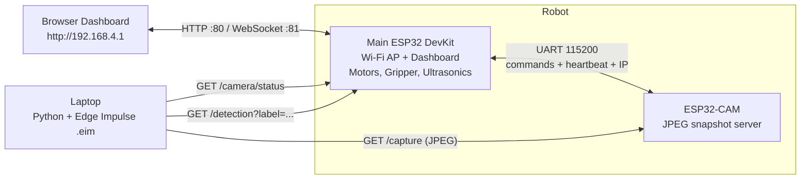

<div align="center">

# 🤖 Robolympics Project — Turbo Car

### Wi-Fi-controlled 4WD robot with gripper, autonomous edge-safe navigation, and AI shape recognition


**Team:** `[TURBO]` &nbsp;|&nbsp; **Institution:** `[Ain Shams University/ Engineering ]` &nbsp;|&nbsp; **Year:** `[Junior]`

</div>

---

## 📑 Table of Contents

1. [Overview](#-overview)
2. [Key Features](#-key-features)
3. [System Architecture](#-system-architecture)
4. [Repository Structure](#-repository-structure)
5. [Hardware](#-hardware)
6. [Software Requirements](#-software-requirements)
7. [Getting Started](#-getting-started)
8. [Operating the Robot](#-operating-the-robot)
9. [Autonomous Navigation](#-autonomous-navigation)
10. [Vision Pipeline](#-vision-pipeline)
11. [Communication Protocols](#-communication-protocols)
12. [Troubleshooting](#-troubleshooting)
13. [Team](#-team)
14. [Acknowledgements](#-acknowledgements)

---

## 🎯 Overview

**Turbo Car** is our entry for the **Robolympics** competition: a four-wheel-drive robot that can be driven in real time from a browser, navigate a raised track on its own without falling off the edges, pick up objects with a servo gripper, and **recognise three object shapes — Pyramid, Cube, and Ball — using a machine-learning model trained with Edge Impulse**.

The system is split across three cooperating nodes:

| Node | Role |
|------|------|
| **Main ESP32 (DevKit)** | Creates the Wi-Fi access point, hosts the web dashboard, drives the motors and gripper, runs autonomous navigation, and bridges to the camera. |
| **ESP32-CAM (AI Thinker)** | Acts as a lightweight snapshot server. Serves a JPEG frame on demand and reports its state to the Main ESP32. |
| **Laptop (Python)** | Pulls frames from the camera, runs Edge Impulse inference, and posts the result back to the robot's dashboard. |

Heavy inference runs on the laptop so the microcontrollers stay responsive, keeping control latency low and behaviour reliable.

---

## ✨ Key Features

- **Real-time control** over WebSocket (port `81`) with a 450 ms control-timeout failsafe.
- **4-motor PWM drive** with proportional differential steering (inside wheels slow down instead of reversing).
- **Servo gripper** driven via the ESP32's built-in LEDC peripheral.
- **Autonomous edge-safe navigation** using four ultrasonic sensors, ground-distance calibration, median-of-5 filtering, hysteresis, and a stale-sensor safety stop.
- **AI shape detection** (Pyramid / Cube / Ball) with Edge Impulse — supports both grayscale and RGB models.
- **Self-healing camera link**: IP discovery over UART, heartbeat monitoring, and automatic state recovery after a camera or Wi-Fi reconnect.
- **Low-latency Wi-Fi tuning**: power-save disabled and TX power maximised on both nodes.
- **Live dashboard** showing robot status, camera state, and detection results.

---

## 🏗 System Architecture



**Data flow for shape detection**

1. The laptop asks the Main ESP32 for the camera's current IP (`/camera/status`).
2. It requests a single JPEG from the camera (`/capture`).
3. The frame is classified by the Edge Impulse model (`.eim`).
4. The label, confidence, and per-class scores are sent back to the Main ESP32 (`/detection`).
5. The Main ESP32 broadcasts the result to the dashboard over WebSocket.

---

## 📁 Repository Structure

| File | Description |
|------|-------------|
| `esp32_devkit_4motorcontrol_wifi.ino` | Main ESP32 firmware: Wi-Fi AP, dashboard, WebSocket control, motor/gripper drive, UART camera link, autonomous navigation. |
| `esp32cam_edge_impulse_shape_only.ino` | ESP32-CAM firmware: Wi-Fi station, `/capture` and `/status` HTTP endpoints, UART state reporting, flash LED control. |
| `laptop_edge_impulse_robot.py` | Laptop script: frame capture → Edge Impulse inference → result upload to the robot. |
| `model_rgb.eim` | Edge Impulse Linux model (RGB input). |
| `model_gray.eim` | Edge Impulse Linux model (grayscale input). |
| `Turbo_Car Functions_Explained_EN.pptx` | Presentation explaining the robot's functions. |
| `CMakeLists.txt` | CMake project configuration. |

---

## 🔧 Hardware

### Bill of Materials

| Qty | Component | Notes |
|-----|-----------|-------|
| 1 | ESP32 DevKit | Main controller |
| 1 | ESP32-CAM (AI Thinker) | Vision node |
| 4 | DC gear motors + wheels | 4WD chassis |
| — | H-bridge motor driver(s) | Two PWM inputs per motor (forward / reverse) |
| 1 | Servo motor | Gripper |
| 4 | HC-SR04 ultrasonic sensors | Front-left, front-right, left-side, right-side |
| 4 | Resistor pairs (2.0 kΩ + 3.9 kΩ) | ECHO voltage dividers (5 V → ~3.3 V) |
| 1 | Battery pack + regulation | Sized for motors, servo, and both ESP32 boards |

### Main ESP32 Pin Map

**Motors**

| Motor | Forward pin | Reverse pin |
|-------|:-----------:|:-----------:|
| Left Front (LF) | GPIO 22 | GPIO 23 |
| Left Rear (LR) | GPIO 25 | GPIO 26 |
| Right Front (RF) | GPIO 4 | GPIO 16 |
| Right Rear (RR) | GPIO 17 | GPIO 18 |

**Gripper** — Servo signal on **GPIO 21** (open ≈ 5°, closed ≈ 180°).

**Ultrasonic sensors**

| Sensor | Position | TRIG | ECHO |
|--------|----------|:----:|:----:|
| LF | Front-left (forward, tilted down) | GPIO 27 | GPIO 34 |
| RF | Front-right (forward, tilted down) | GPIO 19 | GPIO 35 |
| LS | Left side (outward, tilted down) | GPIO 14 | GPIO 36 |
| RS | Right side (outward, tilted down) | GPIO 13 | GPIO 39 |

> ⚠️ **HC-SR04 ECHO pins output 5 V.** Each ECHO line must go through a voltage divider (2.0 kΩ from ECHO to the GPIO, 3.9 kΩ from the GPIO to GND) before reaching the ESP32.

### UART Link (Main ⇄ ESP32-CAM)

| Main ESP32 | ESP32-CAM |
|:----------:|:---------:|
| GPIO 32 (TX) | GPIO 3 (RX) |
| GPIO 33 (RX) | GPIO 1 (TX) |
| GND | GND |

> ⚠️ The camera uses UART0 (the programming pins). **Disconnect the Main ESP32's TX/RX wires while uploading firmware to the ESP32-CAM.**

---

## 💻 Software Requirements

**Firmware (Arduino IDE)**

- Arduino IDE with the **ESP32 board package** installed
- Library: [`arduinoWebSockets`](https://github.com/Links2004/arduinoWebSockets) by Markus Sattler (Links2004)
- Board selection:
  - Main controller → **ESP32 Dev Module**
  - Camera → **AI Thinker ESP32-CAM** (PSRAM enabled)

**Laptop (Linux or Windows via WSL2)**

- Python 3.x
- Python packages:

```bash
pip install opencv-python numpy requests edge_impulse_linux
```

- A Linux x86_64 Edge Impulse model (`model_rgb.eim` or `model_gray.eim`, included in this repo)

---

## 🚀 Getting Started

### 1. Clone the repository

```bash
git clone https://github.com/Eng3mr5aled/Robolympics-Project.git
cd Robolympics-Project
```

### 2. Flash the Main ESP32

1. Open `esp32_devkit_4motorcontrol_wifi.ino` in the Arduino IDE.
2. Select **ESP32 Dev Module** and the correct COM port.
3. Upload.

### 3. Flash the ESP32-CAM

1. **Disconnect** the UART wires (GPIO 1 / GPIO 3) between the two boards.
2. Open `esp32cam_edge_impulse_shape_only.ino`, select **AI Thinker ESP32-CAM**, and upload.
3. Reconnect the UART wires and power-cycle the robot.

> Both sketches use `WIFI_CHANNEL 6` and the same SSID/password. If you change them in one, change them in both.

### 4. Connect to the robot

| Setting | Value |
|---------|-------|
| Wi-Fi SSID | `ESP32_Turbo` |
| Password | `123456789` |
| Dashboard | `http://192.168.4.1` |

> 🔒 These are the default credentials. Change `AP_SSID` and `AP_PASSWORD` in **both** sketches before any public deployment.

### 5. Run the AI detection script

With your laptop connected to the `ESP32_Turbo` network and the camera switched **ON** from the dashboard:

```bash
python laptop_edge_impulse_robot.py --model model_rgb.eim
```

| Option | Default | Description |
|--------|---------|-------------|
| `--model` | `model.eim` | Path to the Edge Impulse Linux model |
| `--interval` | `0.20` | Delay between inference cycles (seconds) |
| `--threshold` | `0.30` | Minimum confidence to report a detection |

On Linux/WSL2 you may need to mark the model executable first: `chmod +x model_rgb.eim`.

---

## 🎮 Operating the Robot

### Keyboard Controls (Dashboard)

| Key | Action |
|:---:|--------|
| ↑ ↓ ← → | Move / steer |
| `Space` | Stop (also exits autonomous mode) |
| `+` / `-` | Increase / decrease speed |
| `G` | Gripper **open** |
| `R` | Gripper **close** |
| `C` | Camera **on** |
| `D` | Camera **off** |
| `E` | Flash **on** |
| `W` | Flash **off** |
| `V` | Toggle reverse controls |
| `A` | Autonomous mode **on** |
| `Q` | Autonomous mode **off** |

### Drive Behaviour

- Default speed is **255 PWM**, adjustable in steps of 10.
- Combined commands (e.g. forward-left) slow the inside wheels to **45 %** of the set speed instead of reversing them.
- If no control message arrives within **450 ms**, the control-timeout failsafe engages.
- Manual drive commands are ignored while autonomous mode is active; **Stop** always works.

---

## 🧭 Autonomous Navigation

The track is **raised with no side walls** — the left and right sides are drop-off edges. Autonomous mode therefore detects *edges*, not walls.

**How it works**

1. **Calibration** — when AUTO starts, each sensor learns the normal ground distance as its baseline.
2. **Filtering** — readings are smoothed with a **median-of-5** filter.
3. **Edge detection** — a sensor flags *warning* or *danger* when its distance rises above baseline by a threshold, or when it stops receiving echoes. **Hysteresis** prevents chatter around the threshold.
4. **Steering** — side sensors apply proportional steering away from the edge; front sensors take priority and trigger protected turns.
5. **Safety stop** — stale or missing sensor data stops the robot.

**State machine:** `DISABLED → CALIBRATING → FORWARD ⇄ BRAKING → TURN LEFT / TURN RIGHT → HAZARD STOP`

**Key parameters**

| Parameter | Value |
|-----------|-------|
| Cruise speed | 170 |
| Caution speed | 120 |
| Turn speed | 125 |
| Autonomous steering ratio | 0.35 |
| Front warn / danger threshold | +5 cm / +10 cm above baseline |
| Side warn / danger threshold | +4 cm / +8 cm above baseline |
| Consecutive no-echo reads = danger | 2 |
| Sensor stale timeout | 220 ms |
| Turn duration (min – max) | 180 – 420 ms |

---

## 👁 Vision Pipeline

- **Classes:** `Pyramid`, `Cube`, `Ball`
- **Camera format:** QVGA (320 × 240) JPEG
- **Inference:** Edge Impulse Linux SDK on the laptop; both image-classification and object-detection models are supported
- **Output:** best label + confidence + individual class scores, shown on the dashboard as `Label | P:xx C:xx B:xx`
- **No detection:** reported as `NONE` when the best score is below the configured threshold

---

## 📡 Communication Protocols

### UART (Main ⇄ ESP32-CAM, 115200 baud)

| Direction | Message | Meaning |
|-----------|---------|---------|
| Main → Cam | `CAM_ON` / `CAM_OFF` | Enable / disable capture |
| Main → Cam | `FLASH_ON` / `FLASH_OFF` | Control flash LED |
| Cam → Main | `CAM_STATE:ON` / `CAM_STATE:OFF` | Camera state |
| Cam → Main | `CAM_FLASH:ON` / `CAM_FLASH:OFF` | Flash state |
| Cam → Main | `CAM_IP:<address>` | Camera's DHCP address |

The camera sends a heartbeat every **1 s**; the Main ESP32 treats the link as lost after **4 s**. Camera ON/OFF commands are retried every 400 ms (up to 10 attempts) until acknowledged.

### HTTP / WebSocket

| Endpoint | Host | Description |
|----------|------|-------------|
| `http://192.168.4.1/` | Main | Web dashboard |
| `ws://192.168.4.1:81` | Main | Real-time control and status stream |
| `GET /camera/status` | Main | JSON: camera state, link status, camera IP |
| `GET /detection?label=&confidence=&p=&c=&b=` | Main | Receives detection results from the laptop |
| `GET /capture` | Camera | Returns a single JPEG frame (`503` if the camera is off or busy) |
| `GET /status` | Camera | JSON: camera state, IP, resolution |

---

## 🛠 Troubleshooting

| Symptom | Likely cause / fix |
|---------|--------------------|
| Camera shows `NO LINK` | Check the UART wiring (TX↔RX crossed, common GND) and that the camera has joined `ESP32_Turbo`. |
| `/capture` returns `503` | Camera is switched off — press `C` on the dashboard — or it is busy; retry. |
| Camera cannot upload firmware | Disconnect the Main ESP32's UART wires from GPIO 1 / GPIO 3 first. |
| Wi-Fi unstable or slow | Change `WIFI_CHANNEL` (use 1, 6, or 11) in **both** sketches. |
| Autonomous mode will not start | Sensors must read valid ground distance during calibration; make sure none is already over an edge. |
| Ultrasonic readings erratic | Verify the ECHO voltage dividers and sensor tilt angles. |
| Laptop script cannot reach the robot | Confirm the laptop is connected to the `ESP32_Turbo` network. |

---

## 👥 Team

**Team `[TURBO]`**

| Name | Role | Links |
|------|------|-------|
| `[Amr Khaled Sedik]` | `[Role, Software ,AI & Vision Camera , Control , Firmware and Dashboard design]` | [@Eng3mr5aled](https://github.com/Eng3mr5aled) |
| `[Mohamed Nabil]` | `[Role, Mechanical Design and shape of car design]` | `[GitHub / LinkedIn]` |
| `[Ahmed Mohamed AbdelAziz]` | `[Role, Electrical connection Electronics and autonomous ]` | `[GitHub / LinkedIn]` |
| `[Mohamed Abdelhay]` | `[Role, Mechanical Design ]` | `[GitHub / LinkedIn]` |
| `[Peter George]` | `[Role,Mechanical Design ]` | `[GitHub / LinkedIn]` |
| `[Essam Mohamed Ghamry]` | `[Role, Mechanical Design ]` | `[GitHub / LinkedIn]` |

**Supervisor / Mentor:** `[Name]`

---

## 🙏 Acknowledgements

- [Edge Impulse](https://edgeimpulse.com) for the embedded ML platform
- [Espressif](https://www.espressif.com) for the ESP32 ecosystem
- [arduinoWebSockets](https://github.com/Links2004/arduinoWebSockets) by Markus Sattler
- The **Robolympics** organizers and our `[University / Organization]` for their support

---

<div align="center">

**Built with ❤️ by Team `[TURBO]`**

</div>
